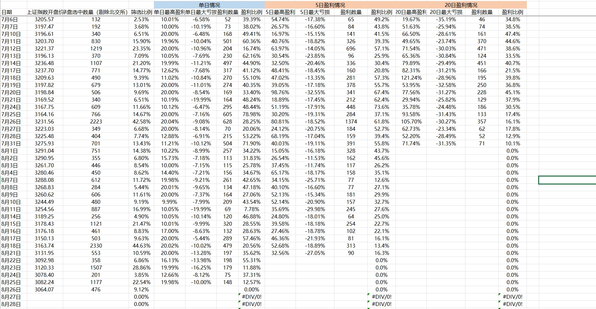
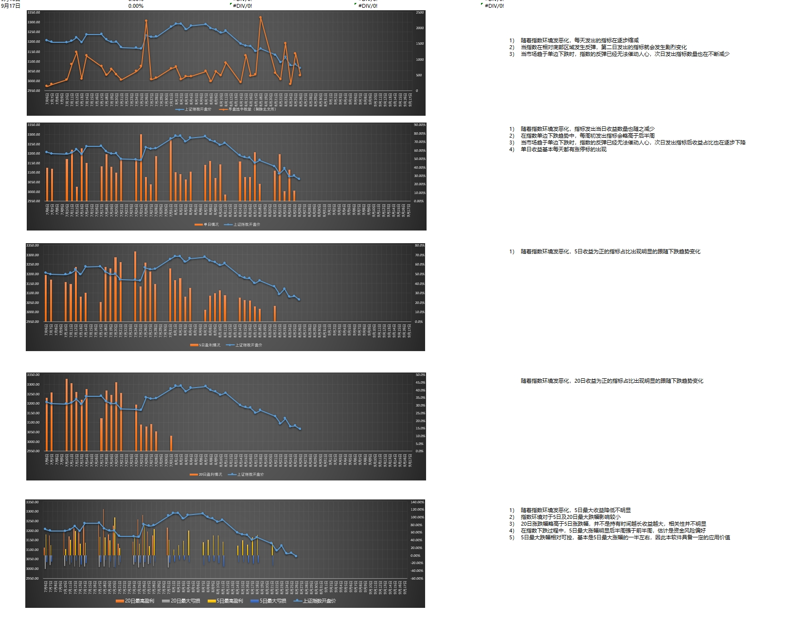

# E.A.S.Y stock system_v1.3

use main.py to run the application

What you need is the py files and the json file

## four function

### ***update data***
The buttom can update the stock data (365 workdays) from akshare

### ***filtrate stock***
the buttom can filtrate stocks' inflection points in days and follow some conditions:

***Day_l>=Day_p * k***

 Day_l  is the ***last workday volume of business***

 Day_p  is the ***Penultimate day volume of business***

 k  is a ***coefficient*** 

### another condition:

the last day must be **uptrend**

the first day to the inflection points must be **downtrend**

### ***print result***
The buttom is to print the result of filtrate stock

### ***Predict stock***
Use math model to predict the next close price of one stock (use the at least 50 days data)

UPDATE 7/13/2023

## The example of stock that my programe filtrated

## The test report

